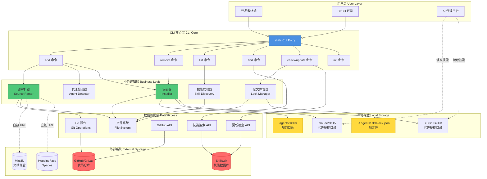
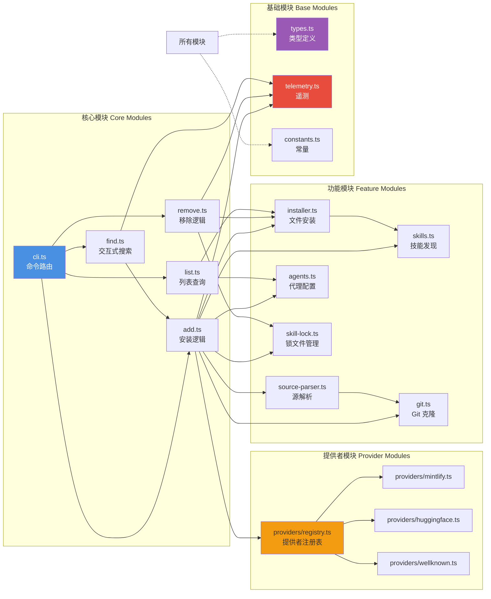
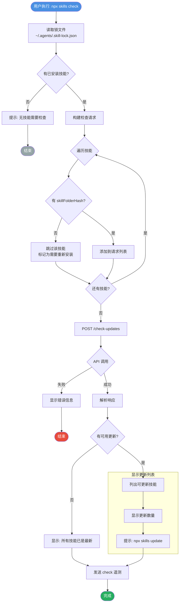
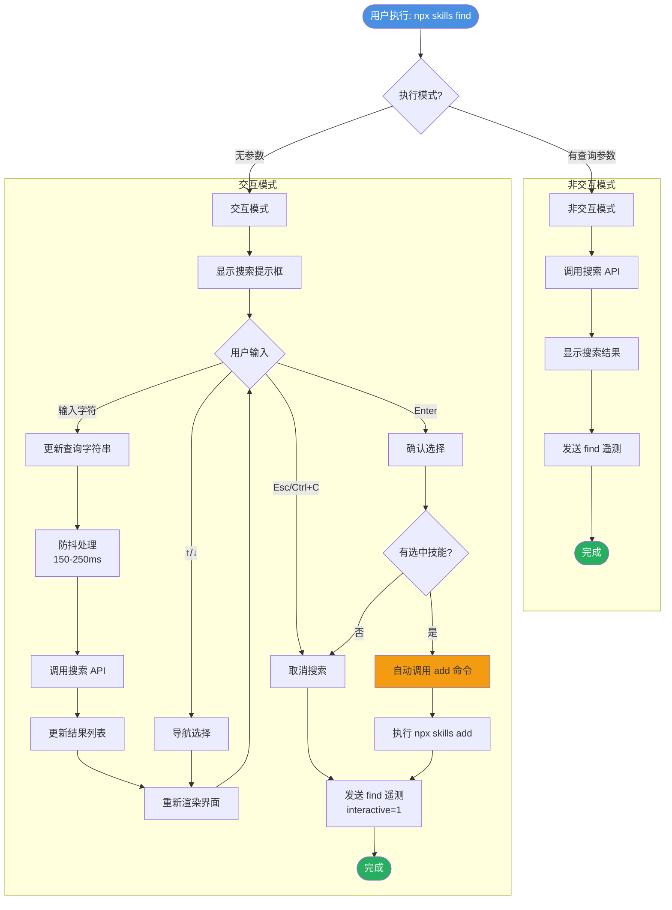
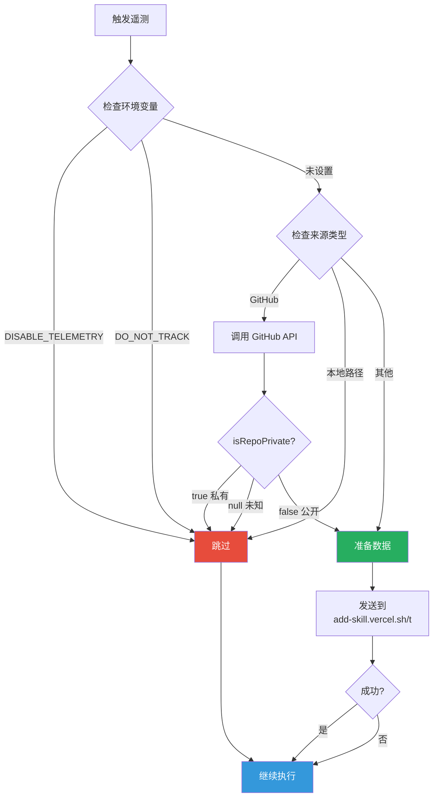
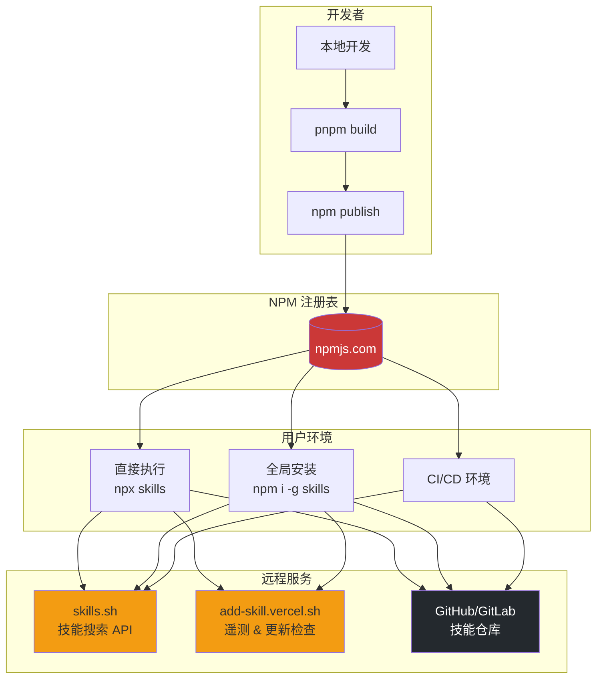
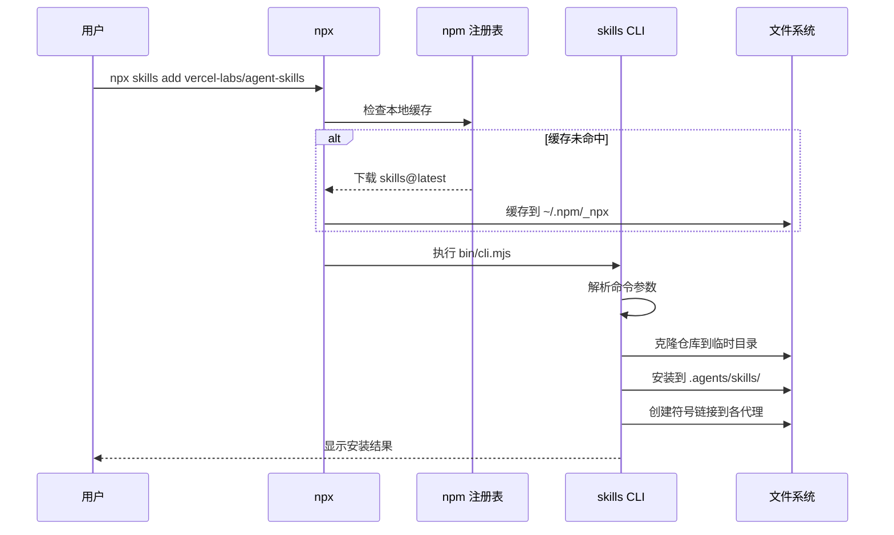

# Skills CLI - 开放代理技能生态系统技术方案

> **项目**: vercel-labs/skills
> **版本**: v1.2.3
> **文档版本**: v1.0.0
> **更新时间**: 2026-01-30

---

## 📋 项目概述

### 项目定位

Skills CLI 是一个开放的 AI 编码代理技能生态系统的命令行工具，旨在为 **40 个 AI 编码代理平台**提供统一的技能包管理解决方案。它解决了 AI 代理技能碎片化、难以共享和管理的问题。

### 核心价值

1. **统一标准**: 定义了 `SKILL.md` 标准格式，统一技能描述规范
2. **跨平台支持**: 支持 Claude Code, Cursor, Windsurf 等 40 个主流 AI 代理平台
3. **灵活安装**: 支持 GitHub、GitLab、本地路径、直接 URL 等多种来源
4. **智能管理**: 提供技能搜索、安装、更新、移除的完整生命周期管理
5. **隐私保护**: 对私有仓库和本地技能提供额外隐私保护

### 技术特色

- ✅ **零配置**: `npx skills add` 即装即用
- ✅ **多平台支持**: 40 个 AI 代理平台自动检测
- ✅ **符号链接优化**: 单一数据源，节省磁盘空间
- ✅ **增量更新**: 基于 GitHub Trees API 的智能更新检测
- ✅ **隐私优先**: 私有仓库自动跳过遥测
- ✅ **CI/CD 友好**: 支持非交互式批量安装

---

## 🏗️ 系统架构

### 整体架构图



### 模块依赖关系图



---

## 🔄 业务流程

### 技能安装完整流程

```mermaid
flowchart TD
    Start([用户执行: npx skills add vercel-labs/agent-skills]) --> ParseCmd[解析命令参数]

    ParseCmd --> CheckEnv{检查环境}
    CheckEnv -->|DO_NOT_TRACK=1| SkipTele[禁用遥测]
    CheckEnv -->|正常| EnableTele[启用遥测]

    EnableTele --> ParseSource[解析来源<br/>source-parser.ts]
    SkipTele --> ParseSource

    ParseSource --> DetectType{来源类型?}

    DetectType -->|GitHub/GitLab| GitFlow[Git 仓库流程]
    DetectType -->|本地路径| LocalFlow[本地路径流程]
    DetectType -->|直接 URL| URLFlow[直接 URL 流程]
    DetectType -->|Well-known| WKFlow[Well-known 流程]

    subgraph "Git 仓库流程"
        GitFlow --> CloneRepo[Git 克隆仓库<br/>git.ts]
        CloneRepo --> DiscoverSkills1[发现技能<br/>skills.ts]
        DiscoverSkills1 --> FilterSkills1[过滤技能<br/>--skill 参数]
    end

    subgraph "本地路径流程"
        LocalFlow --> ValidatePath[验证路径存在]
        ValidatePath --> DiscoverSkills2[发现技能]
        DiscoverSkills2 --> FilterSkills2[过滤技能]
    end

    subgraph "直接 URL 流程"
        URLFlow --> FetchSkill[获取 SKILL.md]
        FetchSkill --> ParseMD[解析 Markdown]
        ParseMD --> CreateRemoteSkill[创建 RemoteSkill]
    end

    subgraph "Well-known 流程"
        WKFlow --> FetchIndex[获取 /.well-known/skills/index.json]
        FetchIndex --> ParseWK[解析技能列表]
        ParseWK --> FilterWK[用户选择技能]
    end

    FilterSkills1 --> DetectAgents
    FilterSkills2 --> DetectAgents
    CreateRemoteSkill --> DetectAgents
    FilterWK --> DetectAgents

    DetectAgents[检测已安装代理<br/>agents.ts] --> AgentFound{找到代理?}

    AgentFound -->|是| AgentList[显示代理列表]
    AgentFound -->|否| PromptAllAgents[提示选择所有代理]

    AgentList --> UserSelectAgent[用户选择代理]
    PromptAllAgents --> UserSelectAgent

    UserSelectAgent --> SelectScope{安装范围?}

    SelectScope -->|--global| GlobalScope[全局安装<br/>~/.agents/skills/]
    SelectScope -->|默认| ProjectScope[项目安装<br/>./.agents/skills/]

    GlobalScope --> SelectMode
    ProjectScope --> SelectMode

    SelectMode{安装模式?} -->|symlink| SymlinkMode[符号链接模式]
    SelectMode -->|copy| CopyMode[复制模式]

    SymlinkMode --> CheckOverwrite1[检查是否覆盖]
    CopyMode --> CheckOverwrite1

    CheckOverwrite1 --> ShowSummary[显示安装摘要]
    ShowSummary --> UserConfirm{用户确认?}

    UserConfirm -->|取消| Cancel([取消安装])
    UserConfirm -->|确认| Install

    subgraph "安装执行"
        Install[执行安装<br/>installer.ts] --> CreateCanonical[创建规范目录<br/>.agents/skills/skillname/]
        CreateCanonical --> CopyFiles[复制 SKILL.md 等文件]
        CopyFiles --> LoopAgents{遍历每个代理}

        LoopAgents --> GetAgentPath[获取代理技能路径<br/>如 .claude/skills/]
        GetAgentPath --> TrySymlink{尝试创建符号链接}

        TrySymlink -->|成功| NextAgent
        TrySymlink -->|失败| FallbackCopy[降级为复制模式]
        FallbackCopy --> NextAgent{还有代理?}

        NextAgent -->|是| LoopAgents
        NextAgent -->|否| InstallDone
    end

    InstallDone[安装完成] --> CheckPrivate{检查仓库隐私}

    CheckPrivate -->|GitHub 公开仓库| SendTelemetry[发送遥测数据<br/>telemetry.ts]
    CheckPrivate -->|GitHub 私有仓库| SkipTelemetry[跳过遥测]
    CheckPrivate -->|本地路径| SkipTelemetry
    CheckPrivate -->|无法确定| SkipTelemetry

    SendTelemetry --> UpdateLock
    SkipTelemetry --> UpdateLock

    UpdateLock{全局安装?} -->|是| WriteLock[写入锁文件<br/>~/.agents/.skill-lock.json]
    UpdateLock -->|否| SkipLock[跳过锁文件]

    WriteLock --> ShowResult
    SkipLock --> ShowResult

    ShowResult[显示安装结果] --> PromptFind[提示安装 find-skills?]

    PromptFind --> End([完成])

    style Start fill:#4A90E2,color:#FFF
    style End fill:#27AE60,color:#FFF
    style Cancel fill:#E74C3C,color:#FFF
    style SendTelemetry fill:#F39C12
    style SkipTelemetry fill:#95A5A6
    style CheckPrivate fill:#9B59B6,color:#FFF
```



### 技能更新检查流程



### 技能搜索流程



---

## 💻 核心技术栈

### 运行时环境

| 技术 | 版本 | 用途 |
|------|------|------|
| **Node.js** | ≥18 | 运行时环境 |
| **TypeScript** | 5.9.3 | 类型安全的开发语言 |
| **pnpm** | 10.17.1 | 包管理器 |

### 核心依赖

| 库 | 版本 | 用途 |
|------|------|------|
| **@clack/prompts** | 0.11.0 | 交互式 CLI 提示界面 |
| **picocolors** | 1.1.1 | 终端颜色输出 |
| **simple-git** | 3.27.0 | Git 操作封装 |
| **gray-matter** | 4.0.3 | Markdown Frontmatter 解析 |
| **xdg-basedir** | 5.1.0 | 跨平台配置目录 |

### 开发工具链

| 工具 | 版本 | 用途 |
|------|------|------|
| **obuild** | 0.4.22 | 构建工具 |
| **vitest** | 4.0.17 | 单元测试框架 |
| **prettier** | 3.8.1 | 代码格式化 |
| **husky** | 9.1.7 | Git Hooks 管理 |
| **lint-staged** | 16.2.7 | 暂存区代码检查 |

---

## 📦 模块设计详解

### 1. 命令路由层 (cli.ts)

**职责**: CLI 入口点，命令解析和路由

```typescript
// 核心命令映射
const commands = {
  'add': runAdd,           // 安装技能
  'remove': removeCommand, // 移除技能
  'list': runList,         // 列出技能
  'find': runFind,         // 搜索技能
  'check': runCheck,       // 检查更新
  'update': runUpdate,     // 更新技能
  'init': runInit          // 初始化技能
};
```

**设计模式**: Command Pattern

---

### 2. 源解析器 (source-parser.ts)

**职责**: 解析多种技能来源格式

**支持的格式**:

```typescript
type SourceType =
  | 'github'      // GitHub 仓库
  | 'gitlab'      // GitLab 仓库
  | 'git'         // 通用 Git URL
  | 'local'       // 本地文件系统路径
  | 'direct-url'  // 直接 SKILL.md URL
  | 'well-known'  // RFC 8615 Well-known URI
```

**解析示例**:

```typescript
// GitHub 短格式
parseSource('vercel-labs/agent-skills')
// => { type: 'github', url: 'https://github.com/vercel-labs/agent-skills.git' }

// 带分支和子路径
parseSource('owner/repo#dev:skills/commit')
// => { type: 'github', url: '...', ref: 'dev', subpath: 'skills/commit' }

// 技能过滤器
parseSource('owner/repo@commit')
// => { type: 'github', url: '...', skillFilter: 'commit' }

// 本地路径
parseSource('./my-skills')
// => { type: 'local', localPath: '/absolute/path/my-skills' }

// 直接 URL
parseSource('https://docs.bun.com/docs/skill.md')
// => { type: 'direct-url', url: 'https://...' }
```

**安全防护**:
- 路径遍历防护: 禁止 `../` 序列
- URL 验证: 使用 URL 解析器验证
- 私有仓库检测: 调用 GitHub API 检查可见性

---

### 3. 代理检测器 (agents.ts)

**职责**: 管理 35+ AI 代理平台配置

**数据结构**:

```typescript
interface AgentConfig {
  name: string;              // 内部标识符
  displayName: string;       // 用户可见名称
  skillsDir: string;         // 项目级技能目录
  globalSkillsDir: string;   // 用户级技能目录
  detectInstalled: () => Promise<boolean>;  // 检测函数
}
```

**支持的代理平台** (部分):

| 代理 | 项目目录 | 全局目录 | 检测方式 |
|------|----------|----------|----------|
| **Claude Code** | `.claude/skills` | `~/.claude/skills` | 检查 `~/.claude` 目录 |
| **Cursor** | `.cursor/skills` | `~/.cursor/skills` | 检查 `~/.cursor` 目录 |
| **Windsurf** | `.windsurfrules/skills` | `~/.windsurfrules/skills` | 检查配置目录 |
| **Codex** | `.codex/skills` | `~/.codex/skills` | 检查 `CODEX_HOME` |
| **Continue** | `.continue/skills` | `~/.continue/skills` | 检查配置目录 |

**检测逻辑**:

```typescript
// 并行检测所有代理
export async function detectInstalledAgents(): Promise<AgentType[]> {
  const results = await Promise.all(
    Object.entries(agents).map(async ([key, config]) => ({
      key,
      installed: await config.detectInstalled()
    }))
  );

  return results
    .filter(r => r.installed)
    .map(r => r.key as AgentType);
}
```

---

### 4. 安装器 (installer.ts)

**职责**: 执行技能文件的物理安装

**安装模式**:

```typescript
type InstallMode = 'symlink' | 'copy';
```

**目录结构**:

```
项目根目录/
├── .agents/
│   └── skills/                    # 规范技能存储
│       └── commit/
│           └── SKILL.md
├── .claude/
│   └── skills/
│       └── commit/                # 符号链接 -> ../../.agents/skills/commit
└── .cursor/
    └── skills/
        └── commit/                # 符号链接 -> ../../.agents/skills/commit
```

**符号链接优势**:
1. **节省空间**: 多个代理共享同一份文件
2. **统一更新**: 更新一次，所有代理同步
3. **原子性**: 符号链接操作是原子的

**降级策略**:

```typescript
async function installWithFallback(src: string, dest: string): Promise<InstallResult> {
  try {
    // 1. 尝试创建符号链接
    await symlink(src, dest);
    return { success: true, mode: 'symlink' };
  } catch (err) {
    // 2. 符号链接失败，降级为复制
    await cp(src, dest, { recursive: true });
    return { success: true, mode: 'copy', symlinkFailed: true };
  }
}
```

**安全措施**:
- 文件名清理: `sanitizeName()` 防止路径遍历
- 路径验证: `isPathSafe()` 确保路径在预期范围内
- 覆盖保护: 安装前检查并提示用户

---

### 5. 技能发现器 (skills.ts)

**职责**: 从目录树中发现和解析技能

**发现算法**:

```typescript
async function discoverSkills(rootDir: string, subpath?: string): Promise<Skill[]> {
  const searchPaths = [
    rootDir,                    // 根目录
    join(rootDir, 'skills'),    // skills/ 子目录
    join(rootDir, 'packages'),  // monorepo packages/
    join(rootDir, 'docs')       // 文档目录
  ];

  if (subpath) {
    searchPaths.unshift(join(rootDir, subpath));
  }

  const skills: Skill[] = [];

  for (const path of searchPaths) {
    await walkDirectory(path, async (file) => {
      if (basename(file) === 'SKILL.md') {
        const skill = await parseSkillMd(file);
        skills.push(skill);
      }
    });
  }

  return skills;
}
```

**SKILL.md 解析**:

```markdown
---
name: commit
description: Create conventional commits with AI assistance
---

# Commit Skill

Instructions for creating semantic commits...
```

解析后:

```typescript
{
  name: 'commit',
  description: 'Create conventional commits with AI assistance',
  path: '/path/to/skill',
  rawContent: '...',
  metadata: { /* other frontmatter fields */ }
}
```

---

### 6. 锁文件管理器 (skill-lock.ts)

**职责**: 管理全局技能安装状态

**锁文件格式** (v3):

```json
{
  "version": 3,
  "skills": {
    "commit": {
      "source": "vercel-labs/agent-skills",
      "sourceType": "github",
      "sourceUrl": "https://github.com/vercel-labs/agent-skills.git",
      "skillPath": "skills/commit/SKILL.md",
      "skillFolderHash": "a1b2c3d4e5f6...",
      "installedAt": "2026-01-30T10:00:00.000Z",
      "updatedAt": "2026-01-30T10:00:00.000Z"
    }
  }
}
```

**关键字段说明**:

| 字段 | 说明 |
|------|------|
| `version` | 锁文件版本 (当前: 3) |
| `skillFolderHash` | GitHub tree SHA，用于检测文件夹级变更 |
| `sourceType` | 来源类型: github/mintlify/huggingface 等 |
| `skillPath` | 技能在仓库中的相对路径 |

**更新检测机制**:

```typescript
// 1. 客户端收集已安装技能的哈希值
const request = {
  skills: [
    {
      name: 'commit',
      source: 'vercel-labs/agent-skills',
      path: 'skills/commit/SKILL.md',
      skillFolderHash: 'abc123'
    }
  ]
};

// 2. 服务器获取最新哈希值并比较
const latestHash = await getGitHubTreeSHA(source, path);
if (latestHash !== currentHash) {
  updates.push({ name, currentHash, latestHash });
}
```

---

### 7. 提供者系统 (providers/)

**职责**: 支持多种技能托管平台

**架构**:

```typescript
interface SkillProvider {
  id: string;                      // 提供者唯一标识
  displayName: string;             // 用户可见名称
  canHandle: (url: string) => boolean;  // URL 匹配函数
  fetchSkill: (url: string) => Promise<RemoteSkill | null>;  // 获取技能
  getSourceIdentifier: (url: string) => string;  // 生成来源标识
}
```

**支持的提供者**:

| 提供者 | ID | URL 模式 | 示例 |
|--------|-----|----------|------|
| **GitHub** | `github` | `github.com/.../blob/...` | `https://github.com/owner/repo/blob/main/SKILL.md` |
| **Mintlify** | `mintlify` | `*.mintlify.com/**` | `https://docs.example.com/skill.md` |
| **HuggingFace** | `huggingface` | `huggingface.co/spaces/**` | `https://huggingface.co/spaces/user/repo/blob/main/SKILL.md` |
| **Well-known** | `well-known` | `**/.well-known/skills/**` | `https://example.com/.well-known/skills/index.json` |

**提供者注册表**:

```typescript
const providers: SkillProvider[] = [
  githubProvider,
  huggingfaceProvider,
  mintlifyProvider,
  wellKnownProvider
];

export function findProvider(url: string): SkillProvider | null {
  return providers.find(p => p.canHandle(url)) || null;
}
```

---

### 8. 遥测系统 (telemetry.ts)

**职责**: 收集匿名使用统计数据

**详细设计**: 参见 [skill-install-telemetry-analysis.md](./skill-install-telemetry-analysis.md)

**隐私保护机制**:



---

## 🔐 安全设计

### 1. 路径安全

**威胁**: 路径遍历攻击 (`../../../etc/passwd`)

**防护**:

```typescript
// 1. 文件名清理
export function sanitizeName(name: string): string {
  return name
    .toLowerCase()
    .replace(/[^a-z0-9._]+/g, '-')  // 移除危险字符
    .replace(/^[.\-]+|[.\-]+$/g, '') // 移除前后导点/横线
    .substring(0, 255) || 'unnamed-skill';
}

// 测试用例
sanitizeName('../../../etc/passwd')  // => 'etc-passwd'
sanitizeName('My Skill!')            // => 'my-skill'
```

```typescript
// 2. 路径验证
function isPathSafe(basePath: string, targetPath: string): boolean {
  const normalizedBase = normalize(resolve(basePath));
  const normalizedTarget = normalize(resolve(targetPath));

  return normalizedTarget.startsWith(normalizedBase + sep);
}

// 测试用例
isPathSafe('/app', '/app/skills/commit')     // => true
isPathSafe('/app', '/app/../etc/passwd')     // => false
```

---

### 2. 隐私保护

**威胁**: 私有仓库信息泄露

**防护**:

```typescript
async function shouldSendTelemetry(source: string): Promise<boolean> {
  const ownerRepo = parseOwnerRepo(source);
  if (!ownerRepo) return true;  // 非 GitHub 源，允许

  const isPrivate = await isRepoPrivate(ownerRepo.owner, ownerRepo.repo);

  // 保守策略: 仅当明确为公开时才上报
  return isPrivate === false;
}

// GitHub API 调用
async function isRepoPrivate(owner: string, repo: string): Promise<boolean | null> {
  try {
    const res = await fetch(`https://api.github.com/repos/${owner}/${repo}`);
    if (!res.ok) return null;  // 无法确定

    const data = await res.json();
    return data.private === true;
  } catch {
    return null;  // 错误时保守处理
  }
}
```

**数据流**:

```
安装私有仓库技能
  ↓
检测到 GitHub 源
  ↓
调用 GitHub API
  ↓
返回 { private: true }
  ↓
跳过遥测上报 ✅
```

---

### 3. 代码注入防护

**威胁**: 恶意技能包执行代码

**防护策略**:

1. **不执行技能代码**: Skills CLI 仅复制 Markdown 文件，不执行任何代码
2. **Markdown 解析**: 使用 `gray-matter` 安全解析 YAML frontmatter
3. **沙箱隔离**: AI 代理负责在沙箱中执行技能指令

```typescript
// 仅解析元数据，不执行代码
import matter from 'gray-matter';

export async function parseSkillMd(path: string): Promise<Skill> {
  const content = await readFile(path, 'utf-8');
  const parsed = matter(content);  // 安全的 YAML 解析

  return {
    name: parsed.data.name,
    description: parsed.data.description,
    path: dirname(path),
    rawContent: content,
    metadata: parsed.data
  };
}
```

---

### 4. 供应链安全

**依赖审计**:

```bash
# 定期检查依赖漏洞
npm audit

# 锁定依赖版本
pnpm install --frozen-lockfile
```

**最小权限原则**:
- 仅依赖 6 个运行时库
- 避免使用具有文件系统完全访问权限的库
- 所有文件操作限制在指定目录内

---

## 🚀 部署架构

### 分发模式



### NPX 执行流程



### CI/CD 集成

**GitHub Actions 示例**:

```yaml
name: Install Skills
on: [push]

jobs:
  setup-skills:
    runs-on: ubuntu-latest
    steps:
      - uses: actions/checkout@v4

      - name: Install skills
        run: |
          npx skills add vercel-labs/agent-skills \
            --skill commit \
            --skill pr-review \
            --agent claude-code \
            --yes
        env:
          DISABLE_TELEMETRY: 1  # 禁用 CI 环境遥测

      - name: Verify installation
        run: npx skills list
```

**Docker 集成**:

```dockerfile
FROM node:18-alpine

# 安装 git (skills 依赖)
RUN apk add --no-cache git

# 全局安装 skills
RUN npm install -g skills

# 预安装常用技能
RUN npx skills add vercel-labs/agent-skills \
    --skill commit \
    --global \
    --yes

WORKDIR /workspace
```

---

## ✨ 技术亮点

### 1. 符号链接优化

**问题**: 多个 AI 代理安装同一技能会浪费大量磁盘空间

**解决方案**:

```
传统复制模式:
.agents/skills/commit/SKILL.md     (10KB)
.claude/skills/commit/SKILL.md     (10KB)
.cursor/skills/commit/SKILL.md     (10KB)
.windsurf/skills/commit/SKILL.md   (10KB)
总计: 40KB

符号链接模式:
.agents/skills/commit/SKILL.md     (10KB)
.claude/skills/commit/             -> ../../.agents/skills/commit/ (0KB)
.cursor/skills/commit/             -> ../../.agents/skills/commit/ (0KB)
.windsurf/skills/commit/           -> ../../.agents/skills/commit/ (0KB)
总计: 10KB (节省 75%)
```

**跨平台兼容性**:

| 平台 | 符号链接支持 | 降级策略 |
|------|--------------|----------|
| Linux | ✅ 原生支持 | - |
| macOS | ✅ 原生支持 | - |
| Windows | ⚠️ 需要开发者模式 | 自动降级为复制模式 |

---

### 2. 增量更新检测

**问题**: 如何高效检测技能文件夹的变更？

**传统方案问题**:
- 单文件哈希: 无法检测新增/删除文件
- 遍历对比: 需要拉取整个仓库，慢且浪费带宽

**Skills CLI 方案**: 使用 GitHub Trees API

```typescript
// 1. 获取技能文件夹的 tree SHA
const tree = await fetch(
  `https://api.github.com/repos/${owner}/${repo}/git/trees/${branch}:${skillPath}`
);
const skillFolderHash = tree.sha;  // 单个 SHA 代表整个文件夹

// 2. 比较 SHA 即可判断是否有变更
if (localHash !== remoteHash) {
  // 有更新可用
}
```

**优势**:
- **高效**: 仅需一次 API 调用
- **准确**: 检测所有文件变更 (新增/修改/删除)
- **节省带宽**: 无需下载文件内容

---

### 3. 多源统一抽象

**问题**: 支持 GitHub、GitLab、本地路径、直接 URL 等多种来源

**解决方案**: Provider Pattern

```typescript
// 统一接口
interface SkillProvider {
  id: string;
  canHandle: (url: string) => boolean;
  fetchSkill: (url: string) => Promise<RemoteSkill | null>;
}

// 自动选择合适的提供者
const provider = findProvider(url);
if (provider) {
  const skill = await provider.fetchSkill(url);
}
```

**扩展性**:
- 新增提供者只需实现 `SkillProvider` 接口
- 无需修改核心安装逻辑
- 支持用户自定义提供者 (未来功能)

---

### 4. 优雅降级机制

**示例 1: 符号链接失败**

```typescript
try {
  await symlink(src, dest);
  return { mode: 'symlink' };
} catch {
  // Windows 没有开发者模式，降级为复制
  await cp(src, dest, { recursive: true });
  return { mode: 'copy', symlinkFailed: true };
}
```

**示例 2: 遥测失败**

```typescript
try {
  fetch(TELEMETRY_URL).catch(() => {});  // Fire-and-forget
} catch {
  // 静默失败，不影响主功能
}
```

**示例 3: GitHub API 限流**

```typescript
const isPrivate = await isRepoPrivate(owner, repo);
if (isPrivate === null) {
  // 无法确定时，保守地跳过遥测
  return;
}
```

---

### 5. 交互式搜索体验

**fzf 风格的实时搜索**:

```
Search skills: type█

  > commit                     vercel-labs/agent-skills
    pr-review                  vercel-labs/agent-skills
    web-design                 vercel-labs/skills
    find-skills                vercel-labs/skills

up/down navigate | enter select | esc cancel
```

**技术实现**:
- **自适应防抖**: 查询越短，防抖时间越长
- **增量渲染**: 仅更新变化的行
- **键盘导航**: 原生 readline 监听
- **光标管理**: ANSI 转义序列控制

```typescript
// 自适应防抖算法
const debounceMs = Math.max(150, 350 - query.length * 50);
// 2 字符: 250ms
// 3 字符: 200ms
// 4+ 字符: 150ms
```

---

## 📊 性能优化

### 并行化策略

```typescript
// ❌ 串行执行 (慢)
for (const agent of agents) {
  const installed = await isSkillInstalled(skillName, agent);
}

// ✅ 并行执行 (快)
const checks = await Promise.all(
  agents.map(agent => isSkillInstalled(skillName, agent))
);
```

**实际应用**:
- 代理检测: 40 个代理并行检测
- 覆盖检查: 多个技能 × 多个代理并行
- Git 克隆: 使用 `simple-git` 的并行能力

---

### 缓存机制

**1. npm 缓存**: npx 自动缓存到 `~/.npm/_npx`
**2. Git 浅克隆**: `git clone --depth 1` 减少克隆时间

```typescript
await git.clone(url, tempDir, {
  '--depth': 1,              // 仅克隆最新提交
  '--single-branch': true,   // 仅克隆指定分支
  '--filter': 'blob:none'    // 延迟下载大文件 (Git 2.25+)
});
```

**3. API 响应缓存**: 搜索 API 内置 15 分钟缓存

---

### 资源清理

```typescript
let tempDir: string | null = null;

try {
  tempDir = await cloneRepo(url);
  // ... 安装逻辑
} finally {
  // 确保临时目录被清理
  if (tempDir) {
    await rm(tempDir, { recursive: true, force: true });
  }
}
```

---

## 🔮 未来规划

### 短期 (1-3 个月)

- [ ] **技能依赖管理**: 支持技能间依赖声明
  ```yaml
  # SKILL.md
  dependencies:
    - commit
    - git-utils
  ```

- [ ] **技能版本控制**: 锁定技能到特定版本
  ```bash
  npx skills add vercel-labs/agent-skills@v1.2.0
  ```

- [ ] **技能模板系统**: 官方技能模板库
  ```bash
  npx skills init --template typescript-linter
  ```

- [ ] **配置文件支持**: `.skillsrc` 配置文件
  ```json
  {
    "defaultAgent": "claude-code",
    "telemetry": false,
    "updatePolicy": "auto"
  }
  ```

### 中期 (3-6 个月)

- [ ] **技能市场**: Web UI 浏览和搜索技能
- [ ] **技能评分系统**: 用户评分和评论
- [ ] **技能分析**: 技能使用统计和推荐
- [ ] **自动更新**: 后台自动检查和更新技能

### 长期 (6-12 个月)

- [ ] **技能组合**: 将多个技能打包为套件
- [ ] **权限系统**: 技能申请文件系统/网络权限
- [ ] **技能沙箱**: 在隔离环境中执行技能
- [ ] **插件系统**: 支持 JavaScript/Python 插件

---

## 📈 性能指标

### 基准测试

| 操作 | 时间 | 备注 |
|------|------|------|
| **首次安装** (GitHub) | ~3-5s | 包含 Git 克隆 |
| **首次安装** (本地) | ~0.5s | 无需网络 |
| **后续安装** (已克隆) | ~0.8s | 复用缓存 |
| **代理检测** (40 个) | ~0.1s | 并行执行 |
| **技能搜索** (API) | ~0.3s | 网络延迟 |
| **更新检查** (10 个技能) | ~1s | GitHub API 批量 |

### 资源占用

| 资源 | 占用 | 说明 |
|------|------|------|
| **磁盘空间** (符号链接) | ~10KB/技能 | 单份存储 |
| **磁盘空间** (复制模式) | ~10KB/技能/代理 | 多份副本 |
| **内存峰值** | ~50MB | Node.js 基础占用 |
| **并发连接** | 3-5 | Git + API 调用 |

---

## 🤝 贡献指南

### 开发环境设置

```bash
# 1. 克隆仓库
git clone https://github.com/vercel-labs/skills.git
cd skills

# 2. 安装依赖
pnpm install

# 3. 本地开发
pnpm dev add vercel-labs/agent-skills

# 4. 运行测试
pnpm test

# 5. 类型检查
pnpm type-check

# 6. 格式化代码
pnpm format
```

### 项目结构

```
skills/
├── src/
│   ├── cli.ts              # CLI 入口
│   ├── add.ts              # 安装逻辑
│   ├── remove.ts           # 移除逻辑
│   ├── list.ts             # 列表查询
│   ├── find.ts             # 交互式搜索
│   ├── agents.ts           # 代理配置
│   ├── installer.ts        # 文件安装
│   ├── skills.ts           # 技能发现
│   ├── source-parser.ts    # 源解析
│   ├── git.ts              # Git 操作
│   ├── skill-lock.ts       # 锁文件管理
│   ├── telemetry.ts        # 遥测系统
│   ├── providers/          # 提供者模块
│   │   ├── registry.ts
│   │   ├── github.ts
│   │   ├── mintlify.ts
│   │   ├── huggingface.ts
│   │   └── wellknown.ts
│   └── types.ts            # TypeScript 类型
├── tests/                  # 测试文件
├── scripts/                # 构建脚本
├── bin/                    # CLI 入口点
└── package.json
```

### 测试策略

```typescript
// 单元测试示例
import { describe, it, expect } from 'vitest';
import { sanitizeName } from './installer';

describe('sanitizeName', () => {
  it('should prevent path traversal', () => {
    expect(sanitizeName('../../../etc/passwd')).toBe('etc-passwd');
  });

  it('should convert to kebab-case', () => {
    expect(sanitizeName('My Cool Skill!')).toBe('my-cool-skill');
  });

  it('should limit length to 255', () => {
    const longName = 'a'.repeat(300);
    expect(sanitizeName(longName)).toHaveLength(255);
  });
});
```

### 提交规范

遵循 [Conventional Commits](https://www.conventionalcommits.org/):

```
feat: add support for GitLab repositories
fix: resolve symlink creation on Windows
docs: update installation guide
test: add tests for source-parser
refactor: simplify agent detection logic
```

---

## 📚 参考资料

### 相关标准

- [RFC 8615 - Well-Known URIs](https://www.rfc-editor.org/rfc/rfc8615.html)
- [Semantic Versioning](https://semver.org/)
- [Conventional Commits](https://www.conventionalcommits.org/)
- [XDG Base Directory](https://specifications.freedesktop.org/basedir-spec/basedir-spec-latest.html)

### 技术文档

- [GitHub Trees API](https://docs.github.com/en/rest/git/trees)
- [Node.js fs Promises API](https://nodejs.org/api/fs.html#promises-api)
- [TypeScript Handbook](https://www.typescriptlang.org/docs/handbook/intro.html)
- [Vitest Documentation](https://vitest.dev/)

### 灵感来源

- [npm](https://www.npmjs.com/) - 包管理器设计
- [Homebrew](https://brew.sh/) - 安装体验
- [fzf](https://github.com/junegunn/fzf) - 交互式搜索
- [Rust Toolchain](https://rustup.rs/) - 多平台支持

---

## 📞 联系方式

- **项目主页**: https://github.com/vercel-labs/skills
- **技能网站**: https://skills.sh/
- **问题反馈**: https://github.com/vercel-labs/skills/issues
- **讨论区**: https://github.com/vercel-labs/skills/discussions

---

## 📄 许可证

本项目采用 [MIT License](https://opensource.org/licenses/MIT) 开源。

---

**文档维护者**: Skills Team @ Vercel Labs
**最后更新**: 2026-01-30
**文档版本**: v1.0.0
