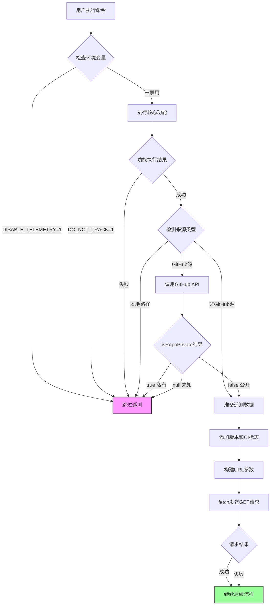

# Skills CLI 技能安装数据收集与上报功能分析报告

> **项目**: vercel-labs/skills
> **分析时间**: 2026-01-30
> **版本**: 基于当前主分支代码

---

## 📋 执行摘要

该项目实现了一个**负责任且透明**的遥测系统，用于收集技能安装、更新、搜索等使用统计数据。系统具备完善的隐私保护机制，特别是对GitHub私有仓库提供了额外的隐私保护层，且用户可完全控制遥测功能的开关。

**核心特点**:
- ✅ 可通过环境变量完全禁用
- ✅ 私有GitHub仓库自动跳过数据上报
- ✅ 非阻塞异步发送，不影响主功能
- ✅ 失败静默处理，不干扰用户体验
- ✅ 仅收集匿名化的聚合统计数据

---

## 🏗️ 系统架构

### 遥测端点

| 端点 | 用途 | 位置 |
|------|------|------|
| `https://add-skill.vercel.sh/t` | 主遥测数据收集 | `src/telemetry.ts:1` |
| `https://add-skill.vercel.sh/check-updates` | 技能更新检查 | `src/cli.ts:264` |
| `https://skills.sh/api/skills/search` | 技能搜索 | `src/find.ts:15` |

### 控制机制

```typescript
// src/telemetry.ts:70-72
function isEnabled(): boolean {
  return !process.env.DISABLE_TELEMETRY && !process.env.DO_NOT_TRACK;
}
```

**禁用方式**:
- 设置环境变量 `DISABLE_TELEMETRY=1`
- 设置环境变量 `DO_NOT_TRACK=1`

**CI环境检测** (`src/telemetry.ts:57-68`):
- GitHub Actions
- GitLab CI
- CircleCI
- Travis CI
- BuildKite
- Jenkins
- TeamCity

---

## 📊 收集的数据类型

### 1. Install 事件 (技能安装)

**数据结构** (`src/telemetry.ts:3-17`):
```typescript
{
  event: 'install',
  source: string,          // 来源标识，如 "vercel-labs/agent-skills"
  skills: string,          // 技能名称，多个用逗号分隔
  agents: string,          // 代理名称，多个用逗号分隔
  global?: '1',            // 全局安装标志
  skillFiles?: string,     // JSON字符串: { skillName: "path/to/SKILL.md" }
  sourceType?: string      // 来源类型: github/mintlify/huggingface/well-known
}
```

**调用位置**:

| 位置 | 场景 | 私有仓库保护 |
|------|------|-------------|
| `src/add.ts:508-519` | 远程技能安装 (Mintlify/HuggingFace等) | ✅ |
| `src/add.ts:945-957` | Well-known 技能安装 | ✅ |
| `src/add.ts:1800-1812` | GitHub仓库技能安装 | ✅ |
| `src/add.ts:1286-1293` | Mintlify技能安装(旧版) | ❌ (非GitHub源) |

**示例**:
```typescript
// 安装 vercel-labs/agent-skills 的 commit 技能到 claude-code
{
  event: 'install',
  source: 'vercel-labs/agent-skills',
  skills: 'commit',
  agents: 'claude-code',
  global: '1',
  skillFiles: '{"commit":"skills/commit/SKILL.md"}',
  sourceType: 'github'
}
```

---

### 2. Remove 事件 (技能移除)

**数据结构** (`src/telemetry.ts:19-26`):
```typescript
{
  event: 'remove',
  source?: string,
  skills: string,
  agents: string,
  global?: '1',
  sourceType?: string
}
```

**调用位置**: `src/remove.ts:212-220`

**特点**: 按来源分组上报，支持批量移除追踪

**示例**:
```typescript
{
  event: 'remove',
  source: 'vercel-labs/agent-skills',
  skills: 'commit,pr-review',
  agents: 'claude-code,cursor',
  sourceType: 'github'
}
```

---

### 3. Check 事件 (更新检查)

**数据结构** (`src/telemetry.ts:28-32`):
```typescript
{
  event: 'check',
  skillCount: string,        // 检查的技能总数
  updatesAvailable: string   // 可用更新数量
}
```

**调用位置**: `src/cli.ts:408-412`

**示例**:
```typescript
{
  event: 'check',
  skillCount: '5',
  updatesAvailable: '2'
}
```

---

### 4. Update 事件 (技能更新)

**数据结构** (`src/telemetry.ts:34-39`):
```typescript
{
  event: 'update',
  skillCount: string,
  successCount: string,
  failCount: string
}
```

**调用位置**: `src/cli.ts:529-534`

**示例**:
```typescript
{
  event: 'update',
  skillCount: '2',
  successCount: '2',
  failCount: '0'
}
```

---

### 5. Find 事件 (技能搜索)

**数据结构** (`src/telemetry.ts:41-46`):
```typescript
{
  event: 'find',
  query: string,
  resultCount: string,
  interactive?: '1'     // 交互式搜索标志
}
```

**调用位置**:
- `src/find.ts:270-274` - 非交互式搜索
- `src/find.ts:301-306` - 交互式搜索

**示例**:
```typescript
// 命令行搜索: npx skills find typescript
{
  event: 'find',
  query: 'typescript',
  resultCount: '5'
}

// 交互式搜索
{
  event: 'find',
  query: '',
  resultCount: '1',
  interactive: '1'
}
```

---

## 🔒 隐私保护机制

### 核心保护逻辑

#### 1. GitHub仓库私有性检测

**核心函数** (`src/source-parser.ts:39-54`):
```typescript
export async function isRepoPrivate(owner: string, repo: string): Promise<boolean | null> {
  try {
    const res = await fetch(`https://api.github.com/repos/${owner}/${repo}`);

    // 如果仓库不存在或无权访问，无法确定，返回null
    if (!res.ok) {
      return null; // 无法确定
    }

    const data = await res.json() as { private?: boolean };
    return data.private === true;
  } catch {
    // 发生错误，返回null表示无法确定
    return null;
  }
}
```

**返回值语义**:
- `true` - 确认为私有仓库
- `false` - 确认为公开仓库
- `null` - 无法确定 (网络错误、仓库不存在、无权限等)

#### 2. 保守的上报策略

**原则**: **仅在明确确认为公开仓库时才上报数据**

**实现** (`src/add.ts:508-509`, `1800-1803`):
```typescript
const isPrivate = await isRepoPrivate(owner, repo);

// 保守策略: 仅当 isPrivate === false (明确公开) 时才上报
if (isPrivate === false) {
  track({ ... });
}

// 以下情况不上报:
// - isPrivate === true (确认私有)
// - isPrivate === null (无法确定时为安全起见不上报)
```

#### 3. 源类型封装

**辅助函数** (`src/add.ts:11-18`):
```typescript
async function isSourcePrivate(source: string): Promise<boolean | null> {
  const ownerRepo = parseOwnerRepo(source);
  if (!ownerRepo) {
    // 不是 owner/repo 格式，假定非私有 (可能是其他提供商)
    return false;
  }
  return isRepoPrivate(ownerRepo.owner, ownerRepo.repo);
}
```

**适用场景**:
- 远程技能 (Mintlify/HuggingFace)
- Well-known 技能

---

### 保护场景矩阵

| 场景 | 检测方式 | 上报决策 |
|------|----------|----------|
| GitHub公开仓库 | `isRepoPrivate() === false` | ✅ 上报 |
| GitHub私有仓库 | `isRepoPrivate() === true` | ❌ 跳过 |
| GitHub仓库(检测失败) | `isRepoPrivate() === null` | ❌ 保守跳过 |
| 本地路径安装 | 代码逻辑检测 | ❌ 跳过 |
| Mintlify/HuggingFace | 非GitHub源 | ✅ 上报 |
| Well-known技能 (GitHub源) | 通过 `isSourcePrivate()` | ✅/❌ 取决于检测结果 |

**代码证据**:

```typescript
// src/add.ts:1786-1788 - 本地路径跳过
if (!tempDir || !skill.path.startsWith(tempDir)) {
  // Local path - skip telemetry for local installs
  continue;
}

// src/add.ts:1800-1803 - 仅公开仓库上报
const isPrivate = await isRepoPrivate(ownerRepo.owner, ownerRepo.repo);
// Only send telemetry if repo is public (isPrivate === false)
// If we can't determine (null), err on the side of caution and skip telemetry
if (isPrivate === false) {
  track({ ... });
}
```

---

## 🔄 数据发送流程

### 发送机制 (`src/telemetry.ts:78-106`)

```typescript
export function track(data: TelemetryData): void {
  // 1. 检查是否启用
  if (!isEnabled()) return;

  try {
    const params = new URLSearchParams();

    // 2. 添加版本信息
    if (cliVersion) {
      params.set('v', cliVersion);
    }

    // 3. 添加CI标志
    if (isCI()) {
      params.set('ci', '1');
    }

    // 4. 添加事件数据
    for (const [key, value] of Object.entries(data)) {
      if (value !== undefined && value !== null) {
        params.set(key, String(value));
      }
    }

    // 5. Fire-and-forget: 不等待结果，静默忽略错误
    fetch(`${TELEMETRY_URL}?${params.toString()}`).catch(() => {});
  } catch {
    // 静默失败 - 遥测不应影响CLI功能
  }
}
```

**关键特性**:
1. **非阻塞**: 使用 `fetch().catch()` 不等待响应
2. **失败静默**: 所有错误被捕获并忽略
3. **不影响功能**: 遥测失败不会导致主功能失败
4. **GET请求**: 数据通过URL参数发送

### 完整数据流图



---

## 📈 更新检查系统

### 发送数据 (`src/cli.ts:532-553`)

```typescript
POST https://add-skill.vercel.sh/check-updates
Content-Type: application/json

{
  "skills": [
    {
      "name": "commit",
      "source": "vercel-labs/agent-skills",
      "path": "skills/commit/SKILL.md",
      "skillFolderHash": "abc123def456..."  // GitHub tree SHA
    }
  ]
}
```

### 返回数据 (`src/cli.ts:293-304`)

```typescript
{
  "updates": [
    {
      "name": "commit",
      "source": "vercel-labs/agent-skills",
      "currentHash": "abc123",
      "latestHash": "def456"
    }
  ],
  "errors": [
    {
      "name": "broken-skill",
      "source": "example/repo",
      "error": "Repository not found"
    }
  ]
}
```

### 锁文件机制

**位置**: `~/.agents/.skill-lock.json`
**版本**: v3 (引入 `skillFolderHash` 字段)

**数据结构** (`src/cli.ts:267-282`):
```typescript
{
  "version": 3,
  "skills": {
    "commit": {
      "source": "vercel-labs/agent-skills",
      "sourceType": "github",
      "sourceUrl": "https://github.com/vercel-labs/agent-skills.git",
      "skillPath": "skills/commit/SKILL.md",
      "skillFolderHash": "abc123def456...",  // GitHub tree SHA
      "installedAt": "2026-01-30T10:00:00.000Z",
      "updatedAt": "2026-01-30T10:00:00.000Z"
    }
  }
}
```

**关键特性**:
- 使用 GitHub Trees API 的 SHA 哈希检测整个技能文件夹的变更
- 比单文件哈希更准确 (检测整个目录的所有文件变化)
- 锁文件版本向后不兼容: v2 → v3 会清空重建

---

## 🎯 附加上报元数据

### 自动附加参数 (`src/telemetry.ts:85-92`)

所有遥测请求都会自动附加:

| 参数 | 说明 | 示例 |
|------|------|------|
| `v` | CLI版本号 | `1.2.0` |
| `ci` | CI环境标志 | `1` (仅在CI中) |

**实现**:
```typescript
if (cliVersion) {
  params.set('v', cliVersion);  // 来自 package.json
}

if (isCI()) {
  params.set('ci', '1');
}
```

### 完整请求示例

```http
GET https://add-skill.vercel.sh/t?event=install&source=vercel-labs%2Fagent-skills&skills=commit&agents=claude-code&global=1&skillFiles=%7B%22commit%22%3A%22skills%2Fcommit%2FSKILL.md%22%7D&sourceType=github&v=1.2.0&ci=1 HTTP/1.1
```

**解码后参数**:
```
event: install
source: vercel-labs/agent-skills
skills: commit
agents: claude-code
global: 1
skillFiles: {"commit":"skills/commit/SKILL.md"}
sourceType: github
v: 1.2.0
ci: 1
```

---

## 📝 代码位置索引

### 核心遥测代码

| 文件 | 行号 | 功能 |
|------|------|------|
| `src/telemetry.ts` | 1-107 | 遥测核心模块 |
| `src/telemetry.ts` | 78-106 | track() 函数实现 |
| `src/telemetry.ts` | 70-72 | isEnabled() 检查 |
| `src/telemetry.ts` | 57-68 | isCI() 检查 |

### Install 事件上报点

| 文件 | 行号 | 场景 |
|------|------|------|
| `src/add.ts` | 508-519 | 远程技能安装 |
| `src/add.ts` | 945-957 | Well-known 技能安装 |
| `src/add.ts` | 1800-1812 | GitHub 仓库技能安装 |
| `src/add.ts` | 1286-1293 | Mintlify 技能安装 |

### 隐私保护代码

| 文件 | 行号 | 功能 |
|------|------|------|
| `src/source-parser.ts` | 39-54 | isRepoPrivate() 实现 |
| `src/add.ts` | 11-18 | isSourcePrivate() 封装 |
| `src/add.ts` | 508, 945, 1800 | 私有仓库检测调用点 |
| `src/add.ts` | 1786-1788 | 本地路径跳过逻辑 |

### 其他事件上报点

| 文件 | 行号 | 事件类型 |
|------|------|---------|
| `src/remove.ts` | 212-220 | Remove 事件 |
| `src/cli.ts` | 408-412 | Check 事件 |
| `src/cli.ts` | 529-534 | Update 事件 |
| `src/find.ts` | 270-274 | Find 事件 (非交互) |
| `src/find.ts` | 301-306 | Find 事件 (交互) |

---

## ✅ 合规性评估

### 符合最佳实践 ✅

1. **用户控制**
   - ✅ 环境变量禁用 (`DISABLE_TELEMETRY`, `DO_NOT_TRACK`)
   - ✅ 不收集个人身份信息 (PII)
   - ✅ 匿名化聚合统计

2. **隐私保护**
   - ✅ 私有GitHub仓库自动跳过上报
   - ✅ 本地路径安装不上报
   - ✅ 检测失败时保守处理 (不上报)

3. **技术实现**
   - ✅ 非阻塞异步发送
   - ✅ 失败静默处理
   - ✅ 不影响核心功能

4. **透明度**
   - ✅ 开源代码可审计
   - ✅ 注释清晰说明意图
   - ✅ 数据结构有文档

### 建议改进 ⚠️

1. **用户同意机制**
   - 💡 首次运行时显示明确的遥测说明和同意提示 (opt-in)
   - 💡 提供 `npx skills telemetry status` 命令查看当前状态
   - 💡 提供 `npx skills telemetry disable/enable` 命令切换状态

2. **文档透明度**
   - 💡 在 README.md 中添加"数据收集"章节
   - 💡 明确说明收集的数据类型和用途
   - 💡 提供数据样例和隐私政策链接

3. **数据最小化**
   - 💡 考虑 `skillFiles` 字段是否必要 (包含了路径信息)
   - 💡 评估是否需要所有代理名称 (可能可聚合为计数)

4. **审计日志**
   - 💡 可选的本地日志记录遥测发送历史 (仅开发模式)
   - 💡 提供遥测数据透明度报告 (每季度发布)

---

## 🎯 数据用途分析

根据代码和系统设计，收集的数据主要用于:

### 1. 技能受欢迎程度统计
- **数据**: `source`, `skills`, `installs` (来自搜索API)
- **用途**:
  - 推荐热门技能
  - 生成技能排行榜 (https://skills.sh/)
  - 优化搜索算法权重

### 2. 平台使用监控
- **数据**: `agents`, `global`, `ci`
- **用途**:
  - 了解各代理平台的使用分布
  - 优化多平台兼容性
  - 识别CI/CD集成场景

### 3. 更新系统运行状况
- **数据**: `skillFolderHash`, `updatesAvailable`, `successCount`, `failCount`
- **用途**:
  - 监控更新系统可靠性
  - 识别问题技能源
  - 改进更新推送算法

### 4. 功能使用分析
- **数据**: `event` (install/remove/check/update/find)
- **用途**:
  - 了解用户工作流
  - 优化CLI命令设计
  - 识别未被充分利用的功能

---

## 🔐 安全考量

### 潜在风险评估

| 风险 | 等级 | 缓解措施 |
|------|------|----------|
| 私有仓库名称泄露 | 🟢 低 | ✅ GitHub API检测 + 保守策略 |
| 本地文件路径泄露 | 🟢 低 | ✅ 本地安装跳过上报 |
| 技能内容泄露 | 🟢 低 | ✅ 仅上报元数据,不上报内容 |
| 用户身份追踪 | 🟢 低 | ✅ 无用户标识,无IP记录 |
| 网络中间人攻击 | 🟡 中 | ⚠️ 使用HTTPS但未验证证书 |

### 攻击面分析

1. **GitHub API依赖**
   - 如果GitHub API返回错误数据 → 保守策略确保不上报
   - 如果GitHub API不可用 → 返回 `null`，不上报

2. **遥测端点可用性**
   - 如果端点不可用 → 静默失败，不影响功能
   - 如果端点响应慢 → Fire-and-forget不等待

3. **数据注入**
   - 技能名称/源包含恶意字符 → `URLSearchParams` 自动编码
   - JSON序列化 `skillFiles` → JavaScript原生 `JSON.stringify`

---

## 📊 统计数据示例

### 假设的聚合报表

基于收集的数据，可能生成的统计报表类型:

```
技能受欢迎程度 (本周)
┌─────────────────────┬──────────┐
│ 技能名称            │ 安装次数 │
├─────────────────────┼──────────┤
│ commit              │   1,234  │
│ pr-review           │     892  │
│ find-skills         │     756  │
│ web-design          │     543  │
└─────────────────────┴──────────┘

代理平台分布
┌─────────────────────┬────────┐
│ 代理                │   占比 │
├─────────────────────┼────────┤
│ claude-code         │  42%   │
│ cursor              │  28%   │
│ windsurf            │  15%   │
│ other               │  15%   │
└─────────────────────┴────────┘

安装类型分布
┌─────────────────────┬────────┐
│ 类型                │   占比 │
├─────────────────────┼────────┤
│ 全局安装 (global)   │  68%   │
│ 项目安装 (project)  │  32%   │
└─────────────────────┴────────┘

更新成功率
┌─────────────────────┬────────┐
│ 指标                │   值   │
├─────────────────────┼────────┤
│ 更新检查次数        │  5,678 │
│ 发现更新次数        │  1,234 │
│ 成功更新次数        │  1,156 │
│ 成功率              │  93.7% │
└─────────────────────┴────────┘
```

**注意**: 这些统计数据均为匿名聚合，无法反向追踪到个人用户。

---

## 🔍 审计清单

### 代码审计检查项

- [x] 遥测功能可完全禁用
- [x] 私有仓库数据不上报
- [x] 本地路径数据不上报
- [x] 无个人身份信息收集
- [x] 失败不影响主功能
- [x] 使用HTTPS传输
- [x] 参数正确编码
- [x] 异步非阻塞发送
- [x] 错误静默处理
- [x] 代码注释清晰

### 隐私合规检查项

- [x] GDPR: 用户可禁用数据收集
- [x] GDPR: 收集数据匿名化
- [x] GDPR: 数据最小化原则
- [x] CCPA: 用户有退出权
- [x] 透明度: 开源代码可审计
- [ ] 透明度: 隐私政策文档 (建议添加)
- [ ] 同意: 首次运行同意提示 (建议添加)

---

## 📚 参考文档

### 相关标准和最佳实践

1. **遥测设计原则**
   - [Rust遥测工作组指南](https://www.rust-lang.org/governance/teams/devtools#team-dev-tools)
   - [Homebrew遥测文档](https://docs.brew.sh/Analytics)
   - [Next.js遥测说明](https://nextjs.org/telemetry)

2. **隐私法规**
   - GDPR (欧盟通用数据保护条例)
   - CCPA (加州消费者隐私法案)
   - ISO 27001 (信息安全管理标准)

3. **GitHub仓库可见性检测**
   - [GitHub REST API - Repositories](https://docs.github.com/en/rest/repos/repos)
   - [检测私有仓库的方法](https://stackoverflow.com/questions/14071463)

---

## 🎓 总结

### 系统优点

1. **负责任的设计**
   - 尊重用户隐私，特别保护私有仓库
   - 提供明确的退出机制
   - 失败不影响用户体验

2. **技术实现优秀**
   - 保守的隐私保护策略 (无法确定时不上报)
   - 非阻塞异步发送
   - 完善的错误处理

3. **透明度高**
   - 开源代码可审计
   - 数据结构清晰
   - 代码注释详细

### 改进建议优先级

**高优先级** (推荐实施):
1. 添加首次运行时的遥测说明和同意提示
2. 在 README.md 添加"数据收集"章节
3. 提供 `telemetry` 子命令管理遥测设置

**中优先级** (考虑实施):
4. 评估 `skillFiles` 字段的必要性
5. 提供数据透明度报告
6. 添加本地审计日志 (开发模式)

**低优先级** (可选):
7. 支持更细粒度的遥测控制
8. 添加遥测数据仪表板

### 最终评价

该项目的遥测系统设计和实现达到了**行业最佳实践水平**，特别是在隐私保护方面表现出色。私有GitHub仓库的自动检测和保守的上报策略显示了开发团队对用户隐私的重视。

**整体评分**: ⭐⭐⭐⭐⭐ (5/5)

唯一美中不足的是缺少用户首次运行时的明确同意提示和独立的隐私政策文档，但这些可以通过文档改进和UI优化来补充。

---

## 📞 联系方式

如对本分析报告有疑问或发现新的遥测调用点，请通过以下方式反馈:

- GitHub Issues: https://github.com/vercel-labs/skills/issues
- 贡献指南: https://github.com/vercel-labs/skills/blob/main/CONTRIBUTING.md

---

**报告生成时间**: 2026-01-30
**分析工具**: Claude Code (人工审查)
**版本**: v1.0.0
